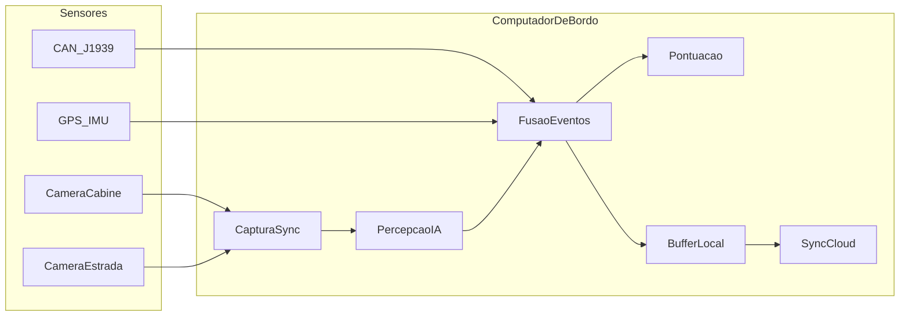

# Plano: avaliação embarcada de comportamento do motorista (2 câmeras)

## Escopo confirmado (opção D)

**Cabine (DMS — Driver Monitoring):** sonolência/fadiga (olhos/fechamento prolongado, bocejo), distração (olhar fora da via, cabeça inclinada), uso de celular (detecção visual + confirmação temporal), cinto (se visível na câmera).

**Estrada (ADAS leve):** desvio de faixa, proximidade excessiva do veículo à frente (time-to-collision aproximado), velocidade relativa quando houver calibração.

**Veículo (fusão):** freada brusca, aceleração agressiva, curvas bruscas — preferencialmente via **CAN** (J1939 em caminhão) ou, na falta de CAN, **IMU + GPS** como proxy.

**Saídas do MVP:** timeline de eventos, score de viagem/sessão, clipes de vídeo curtos por evento, telemetria para backend (quando online).

---

## Arquitetura de alto nível



**Princípios de design**

- **Pipeline assíncrono por câmera** com filas limitadas (drop de frames antigos) para manter latência estável.
- **Inferência em GPU** para detecção/pose; regras temporais em CPU (janelas de 1–30 s) para reduzir falsos positivos.
- **Eventos como máquina de estados** (ex.: `celular_suspeito` → `celular_confirmado` após N frames + contexto).
- **Gravação em anel** + export só de trechos com evento (privacidade e armazenamento).

---

## Hardware recomendado (plataforma não definida — default sensato)

| Componente | Recomendação MVP | Observação |
|------------|------------------|------------|
| Computador | **NVIDIA Jetson Orin Nano 8 GB** ou **Orin NX** | Duas streams 720p@15–30 fps + vários modelos TensorRT; bom equilíbrio custo/IA |
| Alternativa | PC industrial x86 + GPU NVIDIA (T400/T600) | Mais dissipação e cabo; útil se já houver padrão de frota x86 |
| Câmeras | 2× USB3 UVC ou GMSL2 (via carrier) com **WDR/IR** na cabine | Cabine: 720p mínimo, IR noturno; estrada: WDR forte |
| CAN | Interface **CAN USB** ou módulo no carrier; parser **J1939** (wheel speed, brake, throttle se exposto) | Nem todo caminhão expõe tudo; mapear PGNs na fase de integração |
| GPS/IMU | Módulo UART/USB (backup para dinâmica do veículo) | Calibrar eixos fixos ao chassi |
| Energia | Entrada 12/24 V com proteção, ignição ACC, UPS pequeno ou graceful shutdown | Evitar corrupção de SD/NVMe |
| Armazenamento | NVMe 256 GB+ ou SSD industrial | Logs + clipes |

**Orçamento de performance (alvo):** cabine ~10–15 fps inferência útil; estrada ~10–15 fps; latência fim-a-fim evento &lt; 2 s para alertas locais.

---

## Stack de software

- **SO:** JetPack (Ubuntu) no Jetson; Linux no x86.
- **Captura:** GStreamer (`v4l2src` / `nvarguscamerasrc`) ou OpenCV com backend GStreamer; timestamps monotônicos + offset entre câmeras (calibrar uma vez).
- **Runtime IA:** TensorRT ou ONNX Runtime + CUDA; modelos exportados a partir de PyTorch.
- **Serviço principal:** **Python** para MVP (velocidade de iteração) ou **C++/Rust** no hot path se CPU saturar — começar Python com núcleo de inferência já otimizado.
- **IPC interna:** filas multiprocessing ou ZeroMQ entre captura, inferência e fusão.
- **Persistência:** SQLite (eventos + metadados) + arquivos MP4/H264 por clipe.
- **Deploy:** systemd units (`capture`, `perception`, `fusion`, `sync`).
- **Repositório sugerido** (greenfield): monorepo `truck-driver-analytics/` com `edge/`, `models/`, `tools/`, `docs/`.

---

## Modelos e lógica por canal

### Cabine

| Sinal | Abordagem | Confirmação temporal |
|-------|-----------|----------------------|
| Rosto / landmarks | Face detector + 68/98 landmarks ou MediaPipe Face Mesh | — |
| Sonolência | EAR (Eye Aspect Ratio), PERCLOS (% olhos fechados em janela) | PERCLOS &gt; limiar por 3–5 s |
| Bocejo | MAR (Mouth Aspect Ratio) | Sequência + contagem |
| Distração | Pose cabeça (yaw/pitch) + gaze aproximado | Olhar fora &gt; 2–3 s |
| Celular | YOLO pequeno (classes: phone) + mão próxima ao rosto | 2 de 3 janelas consecutivas |
| Cinto | Detector dedicado ou heurística região peitoral (fase 2 se MVP apertado) | Opcional pós-MVP se precisão baixa |

### Estrada

| Sinal | Abordagem |
|-------|-----------|
| Faixa | Lane detector (segmentação leve ou Ultra-Fast-Lane-Detection exportado TRT) |
| Veículo à frente | YOLO / RT-DETR nano em ROI central |
| Distância / TTC | Homografia aproximada ou bbox height + calibração câmera (placa de chão) |
| Desvio | Posição das faixas vs. centro do veículo na imagem |

### Fusão CAN/GPS

- **Frenagem brusca:** deceleração derivada de wheel speed (CAN) ou GPS speed; limiar configurável (ex. &gt; 4–5 m/s²).
- **Curva agressiva:** yaw rate IMU ou combinação velocidade + heading GPS; lateral accel estimada.
- **Correlação:** evento visual (distração) + dinâmica (desvio de faixa) aumenta severidade no score.

---

## Pontuação e eventos

**Taxonomia de eventos (exemplos):** `DROWSINESS`, `DISTRACTION`, `PHONE_USE`, `LANE_DEPARTURE`, `TAILGATING`, `HARD_BRAKE`, `HARD_TURN`, `NO_SEATBELT`.

**Score de sessão (0–100):** penalidades ponderadas por severidade e duração; decaimento temporal (eventos recentes pesam mais); normalizar por km/tempo se houver odômetro/GPS.

**Alertas locais (opcional MVP):** buzzer CAN-free via GPIO ou integração com buzzer da cabine; cuidado regulatório/distração — preferir alerta sonoro curto só para sonolência crítica.

---

## Privacidade, LGPD e operação

- Política clara: **finalidade** (segurança/treinamento), retenção (ex. 30 dias clipes, 1 ano metadados).
- **Minimização:** blur de terceiros/placas na exportação se não necessário; ou gravar só ROI interna na cabine.
- Consentimento do motorista e contrato com transportadora.
- Modo **off-duty:** pausar gravação cabine quando veículo parado + ignição off (configurável).

---

## Fases de implementação

### Fase 0 — Prova de conceito (2–3 semanas)

- Bench com 2 webcams no Jetson ou PC com GPU.
- GStreamer: duas pipelines estáveis, FPS e uso de GPU medidos.
- Um modelo cabine (face + EAR) + um estrada (YOLO veículos).
- Log de eventos em JSON/SQLite.

### Fase 1 — MVP embarcado (6–10 semanas)

- Montagem hardware veículo teste; CAN sniff + mapa mínimo de sinais.
- Pacote completo de modelos TRT; fusão temporal; clipes automáticos.
- Dashboard local simples (Flask/FastAPI) ou só export CSV para análise.
- Testes rodoviários: matriz confusão manual em ~20 h de vídeo rotulado.

### Fase 2 — Produto piloto (8–12 semanas)

- Sync 4G/Wi‑Fi, backend (API + fila), painel frota.
- Ajuste de limiares por frota; OTA de modelos.
- Hardening: watchdog, recovery, temperatura, vibração.

### Fase 3 — Escala

- Homologação elétrica/embarque; variantes de caminhão; certificações se aplicável.

---

## Estrutura de projeto (a criar)

```
truck-driver-analytics/
  edge/
    capture/          # GStreamer, sync timestamps
    perception/       # runners DMS + road
    fusion/           # rules, state machines, CAN/GPS
    scoring/
    storage/
    sync/
    config/           # YAML por frota/veículo
  models/
    export/           # scripts ONNX -> TensorRT
    benchmarks/
  datasets/           # gitignore; links para rotulagem
  tools/
    label_review/
    replay/           # reproduzir logs + vídeo
  docs/
    architecture.md
    can_pgn_map.md
    event_catalog.md
  deploy/systemd/
```

---

## Riscos principais e mitigação

| Risco | Mitigação |
|-------|-----------|
| Falsos positivos (distração/celular) | Janelas temporais, histerese, calibração por frota |
| CAN incompleto no veículo | Fallback GPS/IMU; documentar PGNs por modelo |
| Calor/vibração em caminhão | Orin industrializado, fixação, throttling de FPS |
| Variabilidade iluminação cabine | Câmera IR + augmentação no treino |
| LGPD | Metadados vs. vídeo; retenção; blur |

---

## Critérios de aceite do MVP (opção D)

- Duas câmeras processadas simultaneamente por ≥ 8 h contínuas sem crash.
- Detecção documentada (precisão/recall alvo) para: sonolência, distração, celular confirmado, desvio de faixa, proximidade, freada/curva via CAN ou fallback.
- Cada evento gera registro com timestamp, tipo, severidade, score parcial e clipe ≤ 30 s.
- Relatório de viagem exportável (JSON/CSV) por sessão.

---

## Próximo passo após aprovação do plano

1. Criar repositório `truck-driver-analytics` e documentar requisitos de hardware de bancada.
2. Implementar Fase 0 (captura dual + um pipeline DMS + um ADAS).
3. Validar em vídeo gravado antes de instalar no caminhão.

Se quiser **fixar a plataforma** (Jetson vs x86 vs baixo custo) ou **priorizar só software sem backend na Fase 1**, isso ajusta cronograma e BOM na próxima iteração do plano.
