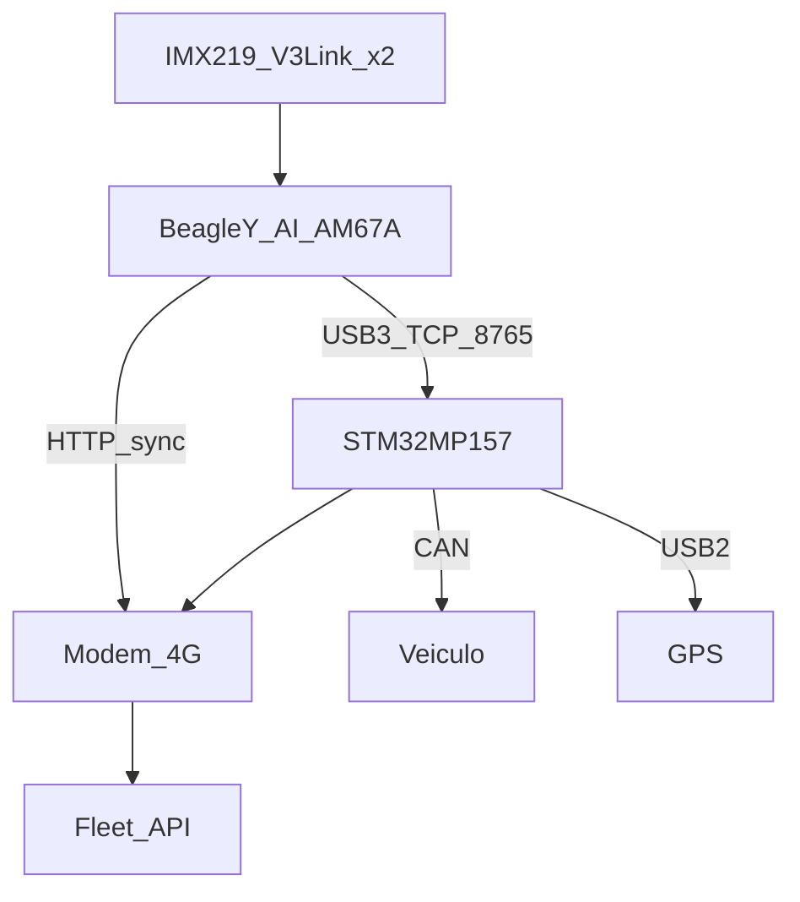

# Arquitetura — Truck Driver Analytics

## Visão geral

O MVP divide responsabilidades entre **BeagleY-AI (AM67A)** e **STM32MP157**:

| Subsistema | Onde roda | Entrada | Saída |
|------------|-----------|---------|--------|
| Captura dual IMX219 V3Link | BeagleY-AI | `/dev/video0`, `/dev/video1` ou libcamera | Frames BGR sincronizados |
| DMS / ADAS | BeagleY-AI | Frames | Métricas + detecções |
| IMU | BeagleY-AI | IIO sysfs / HAL | Aceleração, yaw rate |
| Fusão + score | BeagleY-AI | Visão + telemetria | Eventos + score |
| SQLite + clipes | BeagleY-AI | Eventos | `events.db`, MP4 |
| CAN J1939 | STM32MP157 | `can0` | JSON/TCP :8765 |
| GPS NMEA | STM32MP157 | `/dev/ttyUSB0` | JSON/TCP |
| Uplink 4G | STM32MP157 (modem) | Rede | HTTPS → backend |
| Sync / OTA | BeagleY-AI (cliente) | Fila SQLite | POST batch + GET manifest |

## Fluxo de dados

## Pipeline de software (BeagleY)

1. `DualCameraCapture` — threads por stream, filas bounded, drop stale.
2. `DmsRunner` / `RoadRunner` — MediaPipe + YOLO ONNX (dev); no alvo, compilar para **TIDL** ou ORT ARM.
3. `FusionEngine` — PERCLOS, distração, celular confirmado, faixa, TTC, freada/curva (CAN/GPS/IMU).
4. `RingBuffer` + `ClipExporter` — clipe lado a lado ≤ 30 s.
5. `EventStore` — SQLite + fila de sync.
6. `SyncWorker` — envia lotes quando 4G disponível (via roteamento Linux).

## Captura IMX219 + V3Link

No BeagleY (Yocto/Debian):

- Confirmar topologia com `media-ctl -p` e regras udev para ordem driver/road.
- Preferir pipeline GStreamer em [`edge/config/default.yaml`](../edge/config/default.yaml).
- Calibrar `sync_offset_ms` uma vez com padrão visual (LED) ou timestamp de hardware V3Link.

## Bridge USB3 BeagleY ↔ STM32MP157

- STM32 executa `tda-gateway` (TCP server `:8765`).
- BeagleY executa `GatewayClient` apontando para IP da interface USB (ex. `192.168.7.1`).
- Mensagens newline-delimited JSON: `vehicle`, `gnss`.

## Privacidade

- `pause_cabin_when_ignition_off` / velocidade mínima para cabine.
- Retenção configurável em política de frota; ver [`event_catalog.md`](event_catalog.md).
